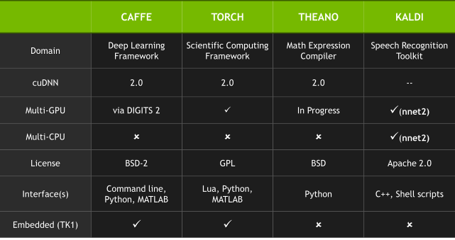

# Getting started with Caffe on Docker environment

## Why use Caffe?

Every Deep Learning framework has its advantages and its drawbacks. I'll use Caffe mainly because it seems to be more out-of-the-box than Theano. But many researchers prefer Theano because of its detailed programming level. See a Reddit discussion on *Best framework for Deep Neural Nets?* at [https://www.reddit.com/comments/2c9x0s](https://www.reddit.com/comments/2c9x0s).



Deep learning frameworks comparison table from [Nvidia courseware](https://developer.nvidia.com/deep-learning-courses).

## Why use Caffe on a Docker container?

Perhaps is the easiest and fastest way to get started with Caffe without breaking your system and your nerves.

## Setup

**1. Install VirtualBox.** You can download VirtualBox for free at [https://www.virtualbox.org/wiki/Downloads](https://www.virtualbox.org/wiki/Downloads).

**2. Install Docker.** A detailed and easy guide for installing Docker on your system can be found here [https://docs.docker.com/installation/](https://docs.docker.com/installation/).

**3. Download and start the Caffe image.** Four different Caffe images for Docker are linked in the official site at [https://github.com/BVLC/caffe/wiki/Installation](https://github.com/BVLC/caffe/wiki/Installation). We will use a stable build of Caffe NoGPU. After running the Docker Terminal we type in the terminal:


	# Pulling the stable build Caffe (NoGPU) image for Docker
	docker pull tleyden5iwx/caffe-cpu-master

	
Now, lets start our newly downloaded image:

	docker run -i -t tleyden5iwx/caffe-cpu-master:latest /bin/bash
	
We will be logged in our Caffe image with a similar prompt like this one **root@4dabab76fab3:~/caffe#**. The hostname displayed in the prompt corresponds to the *Container ID*, in this case the *4dabab76fab3* is our Container ID. It is important to keep the *Container ID* to commit any changes in the image.

**4. Installing the required stuff.**  These steps will install the required packages to have a Jupyter notebook working. (Note that the current user is root).

	# Updating our system
	apt-get update &&  apt-get upgrade
		
	# Installing numerical libraries
	sudo apt-get install liblapack-dev liblapack-doc-man liblapack-doc liblapack-pic liblapack3 liblapack-test liblapack3gf liblapacke liblapacke-dev

	# Installing Python's pip and Jupyter
	apt-get install python-pip python-numpy python-scipy python-matplotlib python-pandas python-sympy python-nose libatlas3gf-base python-sklearn python-yaml
	pip install jupyter	
	

		                   	
**5. Saving the container image.** Now we should logout the current running image and save it. We can logout the image by typing *exit* and hitting enter or by pressing **Ctrl+D**. Now, we can save the image using the Container ID we got in step 3.

	docker commit -m "Setup completed" 4dabab76fab3 tleyden5iwx/caffe-cpu-master:v1

**6. Running Jupyter notebook.** We can call a Jupyter notebook using the next command:

	 docker run -i -p 8888:8888 -t tleyden5iwx/caffe-cpu-master:v1 /bin/bash -c 'cd ~ && jupyter notebook --port=8888 --ip="*" --no-browser'
	 
## Getting started with LeNet on MNIST dataset

**1. Logging in the Docker image.** As in the third step of last section we must logging in the Docker image:

	 docker run -i -t tleyden5iwx/caffe-cpu-master:v1 /bin/bash
	 
**2. Traing the LeNet network.**

```bash
 # Going to the Caffe directory
 cd /opt/caffe
 
 # Downloading the MNIST dataset
 ./data/mnist/get_mnist.sh 
 
 # Converts the data into lmdb/leveldb format (Calls a C++ binary that does the dirty job	 ./examples/mnist/create_mnist.sh
```

Since we are using only the CPU, we must do something before training the model. We have to replace the line *solver_mode: GPU* for *solver_mode: CPU* in the ** lenet_solver.prototxt ** file. We can do this using any editor, for example by calling

	sed -i 's/solver_mode: GPU/solver_mode: CPU/' examples/mnist/lenet_solver.prototxt
	
Now lets train the model by doing

	./build/tools/caffe train --solver=examples/mnist/lenet_solver.prototxt

This will take a few minutes and will output logging messages. When it is done training the model, it will create the files **lenet_iter_10000.* ** on the *examples/mnist/* directory.
	 
	 
## Useful resources

* Docker cheatsheet [https://github.com/wsargent/docker-cheat-sheet](https://github.com/wsargent/docker-cheat-sheet).
* The Docker Book by James Turnbull.